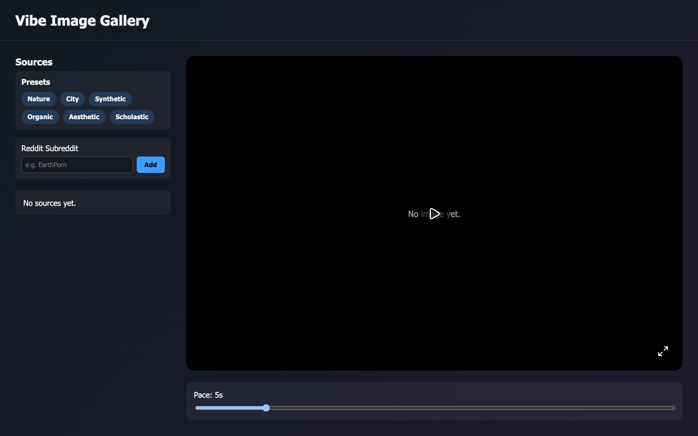

# Vibe Image Gallery


> This is vibe coded by gpt-5-codex

Vibe Image Gallery is a Vite + React TypeScript single-page app for building a rotating slideshow sourced from Reddit subreddits and Unsplash tags.



*Captured via `npm run screenshot` with Playwright.*

## Features

- Manage a scrollable catalog of Reddit and Unsplash sources and build a playlist-like queue
- Randomly rotate through fetched images once playback starts, with custom pacing controls
- Toggle full screen viewing and adjust slide duration with an intuitive slider
- Strong runtime guards powered by helper assertions to keep the UI honest

## Installation

```sh
npm install
```

## Running

```sh
npm run dev
```

Open `http://localhost:5173` in your browser to try the gallery. Add one or more sources, then press **Play**. For a production build that runs the type checker before emitting optimized assets use:

```sh
npm run build
```

## Development Setup

- Node.js 20+ (see `package.json` engines field)
- Modern browser (Chrome, Edge, or Firefox) for local testing
- Run `npm test` regularly to keep the slideshow logic covered while iterating

## Testing

Run the test suite with the Node test runner:

```sh
npm test
```

## Contribution Guidelines

- Create a feature branch for your changes.
- Run `npm test` (and other relevant checks) before opening a pull request.
- Describe the motivation for the change and any trade-offs in the PR description.

## License

This repository is private and not currently distributed under a public license. Contact the maintainers before reusing the code.
